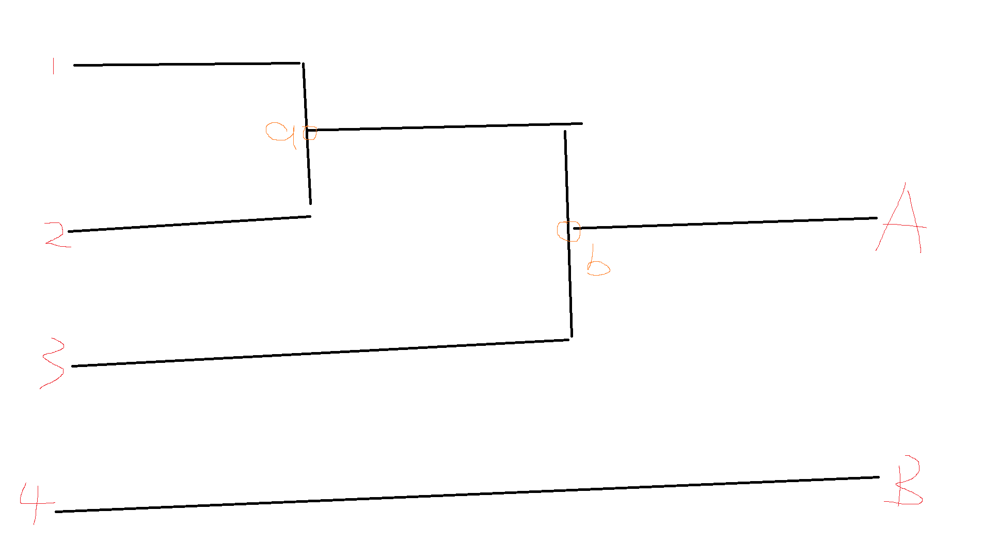
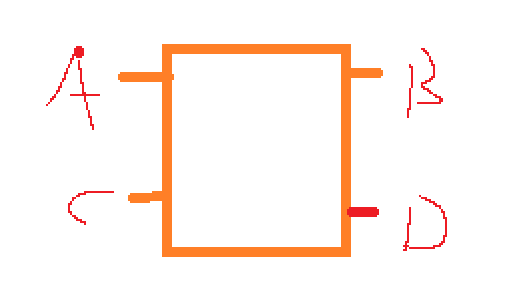

## 运行流程

1. [main](./main.md)
2. [timing_analysis](./timing_analysis.md).[run()](#run)
3. [io](./io.md).read()
4. [timing_analysis](./timing_analysis.md).perform_timing_analysis()
    - [timing_analysis](./timing_analysis.md).search_node_to_end()
    - [timing_analysis](./timing_analysis.md).calculate_arrival_times()
    - ...
    - [timing_analysis](./timing_analysis.md).search_node_to_end()
    - [timing_analysis](./timing_analysis.md).calculate_arrival_times()
5. [timing_analysis](./timing_analysis.md).perform_operation_global_slack()
6. [io](./io.md).write_to_global_slack()
7. over

### run

in [analysis/timing_Analysis.cpp/run()](../analysis/timing_Analysis.cpp)

```c++
void run(Cli cli){
     TimingAnalysis data;
     //读取数据
     std::cout << "Reading data ..." << std::endl;
     read_csv_to_edges(cli.edge_filename, data);
     read_setup_check_data(cli.setup_check_filename, data.setup_checks);
     read_startpoints(cli.startpoints_filename, data.startpoints);
     read_endpoints(cli.endpoints_filename, data.endpoints);
     std::cout << "Reading data completed ..." << std::endl;
     //计算数据
     std::cout << "Calculate arr-time ..." << std::endl;
     perform_timing_analysis(data, cli.thread_pool_len);
     std::cout << "Calculate arr-time completed ..." << std::endl;

     //得到slack
     slacks.endpoints = data.endpoints;
    std::cout << "Calculate global-slack..." << std::endl;
    perform_operation_global_slack(cli.thread_pool_len,slacks,data);
    std::cout << "Calculate global-slack completed ..." << std::endl;
    std::cout << "--------" << len << "<>" << data.endpoints.size() << "<>" << data.arrival_times.size() << std::endl;
    // 输出到global_slack.csv
    std::cout << "Write Slack ..." << std::endl;
    write_to_global_slack(slacks, cli.input_global_slack_filename);
    std::cout << "Write Slack Complete ..." << std::endl;
	    for(auto it=slacks.Slack_Fall.begin();it!=slacks.Slack_Fall.end();it++) {
        std::cout << it->first <<","<<slacks.Slack_Rise[it->first]<<","<<slacks.Slack_Fall[it->first]<< std::endl;
    }
}
```

当我们拿到各个文件的路径时我们第一步将进入[文件的读取](./io.md)，对文件进行依次读取

相信你已经从文件读取讲解中回来
我们开始进行正式的计算工作


### perform_timing_analysis
```c++
void perform_timing_analysis(TimingAnalysis& data, int thread_pool_len){
//    data.arrival_times["CLK"] = ArrivalTime{{0.0}, {0.0}, {0.0}, {0.0}};
    for (const auto& startpoint : data.startpoints) {
        data.arrival_times[startpoint] = ArrivalTime{
            {0.0}, {0.0}, {0.0}, {0.0},
            {0.0}, {0.0}, {0.0}, {0.0},
            {0.0}, {0.0}, {0.0}, {0.0}
        };
    }

    for (int i = 0; i < data.endpoints.size(); i += thread_pool_len){
        ThreadPool pool(thread_pool_len);

        for (size_t j = i; j < i + thread_pool_len && j < data.endpoints.size(); ++j) {
            std::string end = data.endpoints[j];
            if (data.node_len[end] > 0){
                for(auto it=data.node_len.begin();it!=data.node_len.end();it++) {
                    it->second = 0;
                }
            }

//            pool.enqueue(thread_for_end,data,data.startpoints[j]);
            thread_for_end(data,end);
        }
    }
}
```
* 第一步根据起点文件对起点进行初始化
* 第二步遍历终点文件拿到终点再对终点进行初始化
* 第三步进入thread_for_end函数

需要注意的是

路径可能例如这样
我们拿到的终点可能是a、b、A、B，假设我们拿到A

我们根据起点去遍历，1开始走node_len++找到a比较node_max_len = 2 > node_len将等待，再从2开始走，走到a此时node_max_len == node_len继续向下走一直走到end既A这个终点才算处理完

在这过程中一旦from为end或者from后面没有路了就是跳出回退

比如说起点为3 但是终点为B，3会走到A，A没有to_node了将回退到b走其它路径最后直到退回到起点走其它起点

并且再走的过程中同步进行计算

这就是大体思路

我们开始看具体的函数

接下来来到thread_for_end

### thread_for_end
```c++
void thread_for_end(TimingAnalysis& data,std::string end){
    for(std::string from: data.startpoints){
//            std::cout << "start: " << from << ", end: " << end << std::endl;

        data.node_len[from] = 0;
        search_node_to_end(from,from,end,data);

    }
}
```
这里就是遍历起点然后从起点开始搜索(search_node_to_end)

### search_node_to_end
```c++
bool search_node_to_end(std::string from_node,std::string  start_node,std::string  end_node,TimingAnalysis& data){

    data.node_len[from_node]++;
    if (end_node == from_node || data.edges.contains(from_node) == 0){
        return true;
    }
    std::unordered_map<std::string, Edge> to = data.edges[from_node];
    for(auto it=to.begin();it!=to.end();it++){

//        std::cout << "start: " << start_node << ", end: " << end_node << std::endl;
        calculate_arrival_times(it->second,data.arrival_times[it->second.from_vertex], data.arrival_times);

        bool is_search =  search_node_to_end(it->first,start_node,end_node,data);
        if (is_search || data.node_len[from_node] < data.node_max_len[from_node]) {
            break;
        }else{
            continue;
        }
    }
    return false;
}
```
根据我刚才的思路这段代码就很好理解了

但是之前要理解递归实际上就是栈

先判断是否已经是终点了或者后面没有路了就回退遍历其它路径
其中for循环是遍历from节点后面的路

这样这里就讲解完了

### perform_operation_global_slack
```c++
void perform_operation_global_slack(int thread_pool_len,GlobalSlacks& slacks, TimingAnalysis& data){
    // 创建一个具有特定数量线程的线程池
    ThreadPool pool(thread_pool_len); // 假设使用4个线程


    for (std::string endpoint: data.endpoints){
        std::unordered_map<std::string, SetupCheck> from_checks= data.setup_checks[endpoint];
        SetupCheck setupCheck;
        std::string start_str;
        for(auto it=from_checks.begin();it!=from_checks.end();it++) {
            setupCheck = it->second;
            start_str = it->first;
        }
        if (!data.arrival_times.count(start_str)){
            len ++;
            ArrivalTime arrival_time;
            arrival_time.min_rise.push_back(0.0);
            arrival_time.max_rise.push_back(0.0);
            arrival_time.min_fall.push_back(0.0);
            arrival_time.max_fall.push_back(0.0);
            arrival_time.node_data_min_rise_delay_mean.push_back(0.0);
            arrival_time.node_data_max_rise_delay_mean.push_back(0.0);
            arrival_time.node_data_min_fall_delay_mean.push_back(0.0);
            arrival_time.node_data_max_fall_delay_mean.push_back(0.0);
            arrival_time.node_data_min_rise_delay_sigma.push_back(0.0);
            arrival_time.node_data_max_rise_delay_sigma.push_back(0.0);
            arrival_time.node_data_min_fall_delay_sigma.push_back(0.0);
            arrival_time.node_data_max_fall_delay_sigma.push_back(0.0);
            data.arrival_times.insert_or_assign(start_str,arrival_time);
        }

        perform_global_slack_on_path(slacks, data, endpoint, setupCheck, start_str);
    }


}
```

这里就很简单了就是遍历终点节点对其进行计算套用格式，这里if会将终点器件的开始节点进行初始化

例如


假设终点为A 那么计算slack时可能会从C开始，而C可能存在没有数值的情况所以对其进行初始化

初始化完就是进入perform_global_slack_on_path套用格式计算